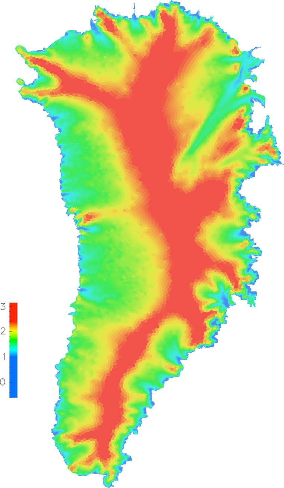
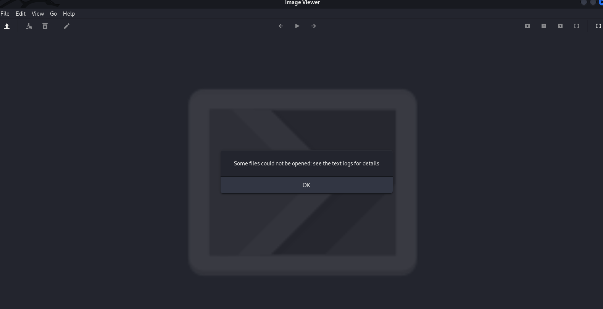
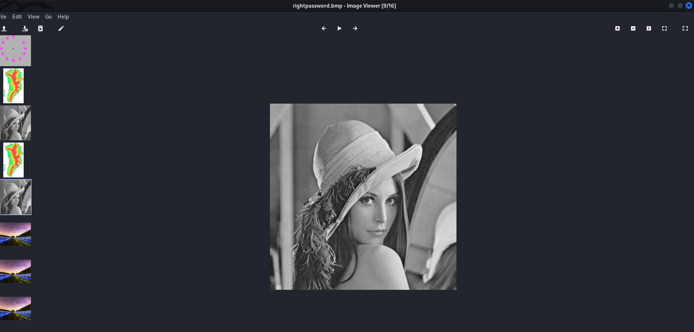
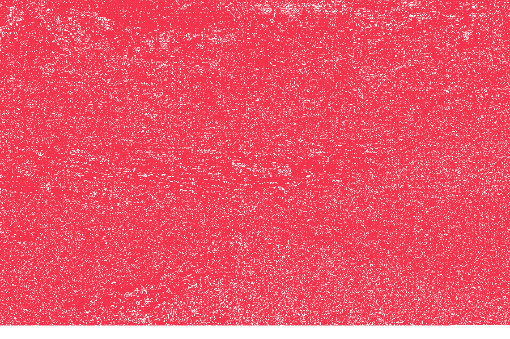
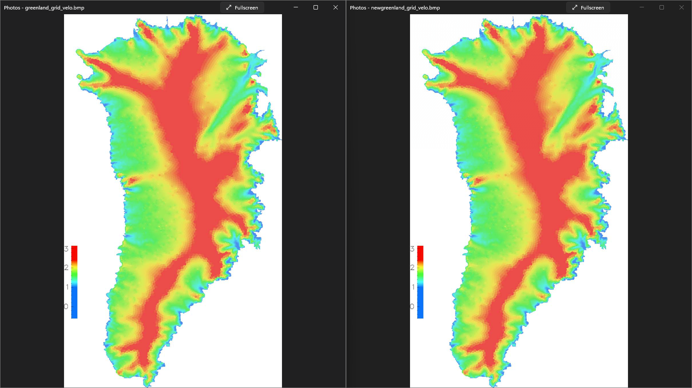
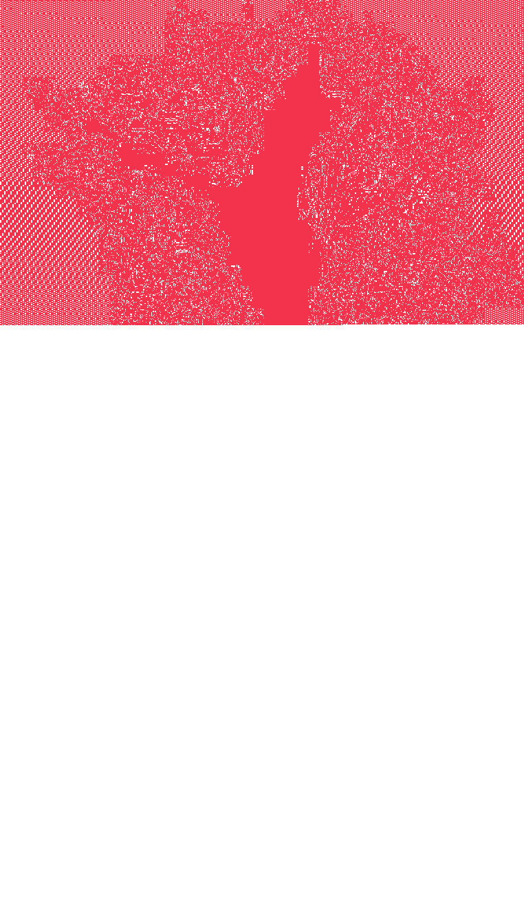

# snake-nography Testing
## Gary. K
### 4/11/2022

[Github Link](https://github.com/d0ntblink/snake-nography)

| ***Function*** | ***Description*** | ***Status*** | ***Example*** |
|:-------------------|:--------------------------------:|:--------------:|----------:|
| --help function | Help funtion assists the user on how the program should be used | *Passed* | [Example](#--help)
| Argument Sanatizing | Wrong arguments are ignore and bad areguments are prompted | *Passed* | [Example](#argument-sanatizing)
| Error | An Error is diplayed for wrong inputs | *Passed* | [Example](#argument-sanatizing)
| Local files as input | Local files are accepted and processed | *Passed* |
| Encryption | Before embedding the image you can encrypt them witha a key | *Passed* | [Example](#encryption)
| Decryption | Same key can be used to decrypt the hidden image | *Passed* | [Example](#decryption)
| Library import | Libraries are imported properly | *Passed* |
| Debug mode | debug mode is available | *Passed* | [Example](#debug)
| PNG and BMP Support | Multiple image options can be selected and processed | *Passed* | [Example](#png-bmp)
| No obvious artifacts | the artifacts created by the program are not visible to the naked eye | *Passed* | [Example](#no-artifacts)
| Small image prompt | If the cover image is too small, program will prompt an error | *Passed* | [Example](#image-too-small)

### --help

```
PS C:\Users\d0ntblink\OneDrive\Projects\snake-nography\Code> python .\snake-nography.py -h
usage: snake-nography.py [-h] [-x <key>] [-d] (-c <secret image> <cover image> <output> | -r <target file> <output>)

This program hides images into other images in lossless format.

options:
  -h, --help            show this help message and exit
  -x <key>, --xcrypt <key>
                        Decrypts or encrypts image using a XOR formula
  -d, --debug           Enables debug mode
  -c <secret image> <cover image> <output>, --cloak <secret image> <cover image> <output>
                        Cloaks an image in another image
  -r <target file> <output>, --reveal <target file> <output>
                        Reveals an image hidden by this program. the output format must match the orginal hidden file format
```

### Argument Sanatizing

```
PS C:\Users\d0ntblink\OneDrive\Projects\snake-nography\Code> python .\snake-nography.py -g
usage: snake-nography.py [-h] [-x <key>] [-d] (-c <secret image> <cover image> <output> | -r <target file> <output>)
snake-nography.py: error: one of the arguments -c/--cloak -r/--reveal is required
PS C:\Users\d0ntblink\OneDrive\Projects\snake-nography\Code> python .\snake-nography.py -g -c 1 2 3
usage: snake-nography.py [-h] [-x <key>] [-d] (-c <secret image> <cover image> <output> | -r <target file> <output>)
snake-nography.py: error: unrecognized arguments: -g
PS C:\Users\d0ntblink\OneDrive\Projects\snake-nography\Code> python .\snake-nography.py -g -c 1 2
usage: snake-nography.py [-h] [-x <key>] [-d] (-c <secret image> <cover image> <output> | -r <target file> <output>)
snake-nography.py: error: argument -c/--cloak: expected 3 **arguments**
```

### Encryption and Decryption

#### Step 1: Encrypting an image

**image I am trying to hide**

**my cover image**

**verysecretpassword as my password**

```
┌──(d0ntblink㉿H0rn3d0wl)-[~/Projects/snake-nography/Data]
└─$ python3 ../Code/snake-nography.py -h
usage: snake-nography.py [-h] [-x <key>] [-d] (-c <secret image> <cover image> <output> | -r <target file> <output>)

This program hides images into other images in lossless format.

optional arguments:
  -h, --help            show this help message and exit
  -x <key>, --xcrypt <key>
                        Decrypts or encrypts image using a XOR formula
  -d, --debug           Enables debug mode
  -c <secret image> <cover image> <output>, --cloak <secret image> <cover image> <output>
                        Cloaks an image in another image
  -r <target file> <output>, --reveal <target file> <output>
                        Reveals an image hidden by this program. the output format must match the orginal hidden file format

┌──(d0ntblink㉿H0rn3d0wl)-[~/Projects/snake-nography/Data]
└─$ python3 ../Code/snake-nography.py -c lena.bmp greenland_grid_velo.bmp notsusimage.png -x "verysecretpassword"

┌──(d0ntblink㉿H0rn3d0wl)-[~/Projects/snake-nography/Data]
└─$ gio open notsusimage.png

```
**outputimage**


#### Step 2: Extracting the Image

**extracting the image without password**

```
┌──(d0ntblink㉿H0rn3d0wl)-[~/Projects/snake-nography/Data]
└─$ python3 ../Code/snake-nography.py -r notsusimage.png nopassword.bmp

┌──(d0ntblink㉿H0rn3d0wl)-[~/Projects/snake-nography/Data]
└─$ gio open nopassword.bmp

┌──(d0ntblink㉿H0rn3d0wl)-[~/Projects/snake-nography/Data]
└─$ ** Message: 15:18:15.395: Could not open file 'file:///home/d0ntblink/Projects/snake-nography/Data/nopassword.bmp': Unsupported mime type
```


**extracting the image with the wrong password**

```
┌──(d0ntblink㉿H0rn3d0wl)-[~/Projects/snake-nography/Data]
└─$ python3 ../Code/snake-nography.py -r notsusimage.png wrongpassword.bmp -x "idkthepasswordbro"

┌──(d0ntblink㉿H0rn3d0wl)-[~/Projects/snake-nography/Data]
└─$ gio open wrongpassword.bmp

┌──(d0ntblink㉿H0rn3d0wl)-[~/Projects/snake-nography/Data]
└─$ ** Message: 15:20:27.653: Could not open file 'file:///home/d0ntblink/Projects/snake-nography/Data/wrongpassword.bmp': Unsupported mime type
^C
```


**extracting with the right password**

```
┌──(d0ntblink㉿H0rn3d0wl)-[~/Projects/snake-nography/Data]
└─$ python3 ../Code/snake-nography.py -r notsusimage.png rightpassword.bmp -x verysecretpassword

┌──(d0ntblink㉿H0rn3d0wl)-[~/Projects/snake-nography/Data]
└─$ gio rightpassword.bmp
```



### No Artifacts

**Right image is image containing another image**

**Last image is the hidden image**

#### Case 1:

```
┌──(d0ntblink㉿H0rn3d0wl)-[~/Projects/snake-nography/Data]
└─$ python3 ../Code/snake-nography.py -c blackbuck.bmp sample_19201280.bmp newsample_19201280.bmp

┌──(d0ntblink㉿H0rn3d0wl)-[~/Projects/snake-nography/Data]
└─$ compare sample_19201280.png newsample_19201280.bmp -compose src diff.png

┌──(d0ntblink㉿H0rn3d0wl)-[~/Projects/snake-nography/Data]
└─$ python3 ../Code/snake-nography.py -r newsample_19201280.bmp case1hidden.bmp
```




```
┌──(d0ntblink㉿H0rn3d0wl)-[~/Projects/snake-nography/Data]
└─$ compare -verbose -metric PSNR newsample_19201280.bmp sample_19201280.bmp /dev/null
newsample_19201280.bmp BMP3 1920x1280 1920x1280+0+0 8-bit sRGB 7.0313MiB 0.070u 0:00.166
sample_19201280.bmp BMP 1920x1280 1920x1280+0+0 8-bit sRGB 7.03138MiB 0.080u 0:00.190
Image: newsample_19201280.bmp
  Channel distortion: PSNR
    red: 37.1459
    green: 32.7486
    blue: 21.5741
    all: 25.9156
newsample_19201280.bmp=>/dev/null BMP3 1920x1280 1920x1280+0+0 8-bit sRGB 0.480u 0:00.086
```

#### Case 2:

```
┌──(d0ntblink㉿H0rn3d0wl)-[~/Projects/snake-nography/Data]
└─$ python3 ../Code/snake-nography.py -c bmp_24.bmp greenland_grid_velo.bmp newgreenland_grid_velo.bmp

┌──(d0ntblink㉿H0rn3d0wl)-[~/Projects/snake-nography/Data]
└─$ compare greenland_grid_velo.bmp newgreenland_grid_velo.bmp -compose src diff.png

┌──(d0ntblink㉿H0rn3d0wl)-[~/Projects/snake-nography/Data]
└─$ python3 ../Code/snake-nography.py -r newgreenland_grid_velo.bmp case2hidden.bmp
```




```
┌──(d0ntblink㉿H0rn3d0wl)-[~/Projects/snake-nography/Data]
└─$ compare -verbose -metric PSNR newgreenland_grid_velo.bmp greenland_grid_velo.bmp /dev/null
newgreenland_grid_velo.bmp BMP3 762x1309 762x1309+0+0 8-bit sRGB 2.8563MiB 0.030u 0:00.079
greenland_grid_velo.bmp BMP3 762x1309 762x1309+0+0 8-bit sRGB 2.8563MiB 0.040u 0:00.077
Image: newgreenland_grid_velo.bmp
  Channel distortion: PSNR
    red: 55.112
    green: 55.2927
    blue: 54.993
    all: 55.1308
newgreenland_grid_velo.bmp=>/dev/null BMP3 762x1309 762x1309+0+0 8-bit sRGB 0.280u 0:00.044
```

### PNG BMP
```
┌──(d0ntblink㉿H0rn3d0wl)-[~/Projects/snake-nography/Data]
└─$ python3 ../Code/snake-nography.py -c bmp_24.bmp greenland_grid_velo.bmp pngout.png

┌──(d0ntblink㉿H0rn3d0wl)-[~/Projects/snake-nography/Data]
└─$ python3 ../Code/snake-nography.py -c bmp_24.bmp greenland_grid_velo.bmp bmpout.bmp
```
### Debug Mode

```
PS C:\Users\d0ntblink\OneDrive\Projects\snake-nography\Code> python .\snake-nography.py -c ..\Data\blackbuck.bmp ..\Data\bmp_08.bmp test.png -d

2022-04-11 15:26:51,831 : secret image info:
color depth: 3
width: 512
height: 512


2022-04-11 15:26:51,832 : need at least 2359458 pixels on the cover image


2022-04-11 15:26:51,832 : cover image info:
color depth: 3
width: 255
height: 255


2022-04-11 15:26:51,832 : row count is 9253


2022-04-11 15:26:51,833 : current row is: 0
0 bytes have passed
```

### Image Too Small
```
┌──(d0ntblink㉿H0rn3d0wl)-[~/Projects/snake-nography/Data]
└─$ python3 ../Code/snake-nography.py -c bmp_24.bmp bmp_08.bmp newimage.png
your cover image is not big enough
```


## Live Presentation Commands

```
## go to the files location
cd /home/d0ntblink/Projects/snake-nography/Extras/livetest

ls -lah

## extract

python3 sg.py -h

python3 sg.py -c hide1.bmp cover1.bmp output1.png -x "hellothisisalivetest"

gio open output1.png

## extract with right password

python3 sg.py -h

python3 sg.py -r output1.png rightpassword.bmp -x "hellothisisalivetest"

gio open rightpassword.bmp

## extract with wrong password

python3 sg.py -r output1.png wrongpassword.bmp -x "wrongpass"

gio open wrongpassword.bmp

### show diffrence 

compare cover1.bmp output1.png -compose src diff1.png

gio open diff1.png


```